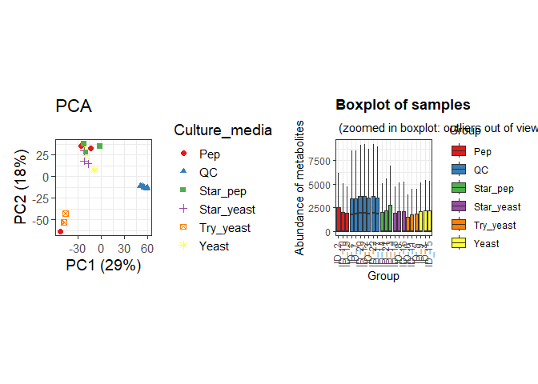
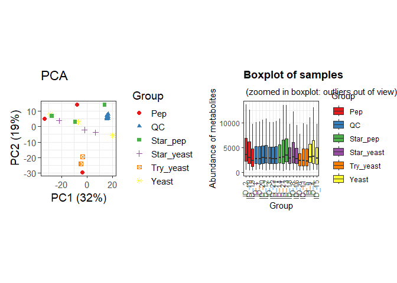
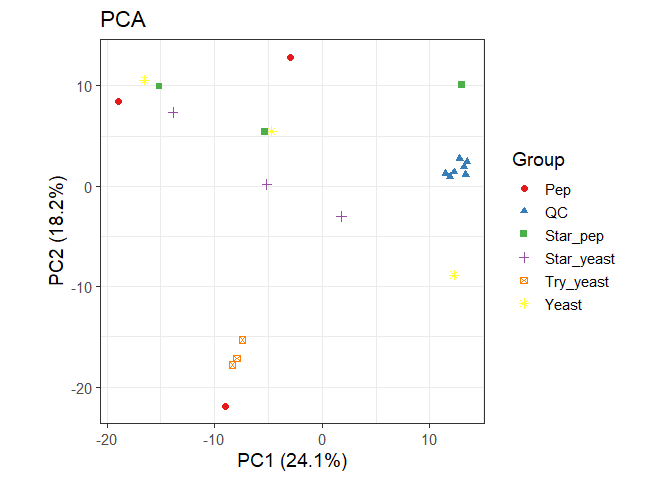
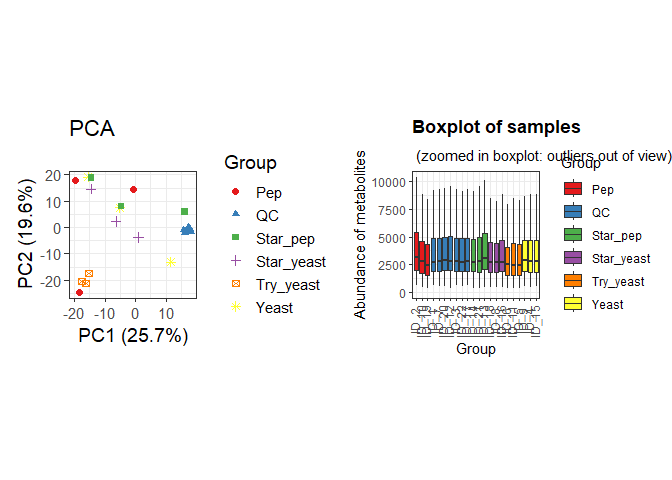
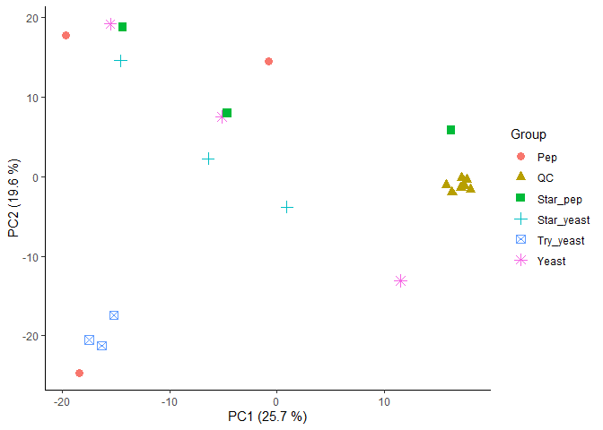
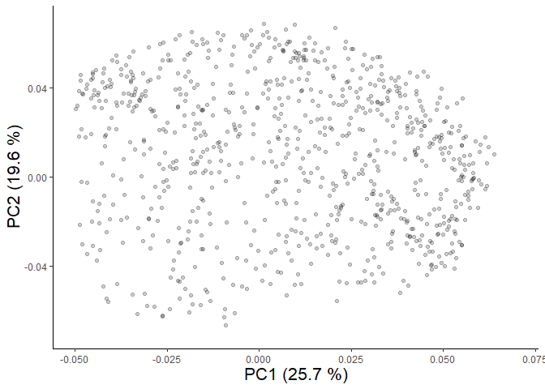
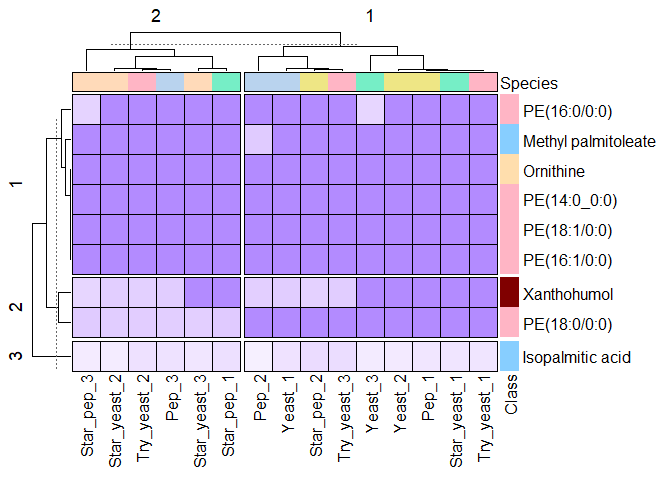
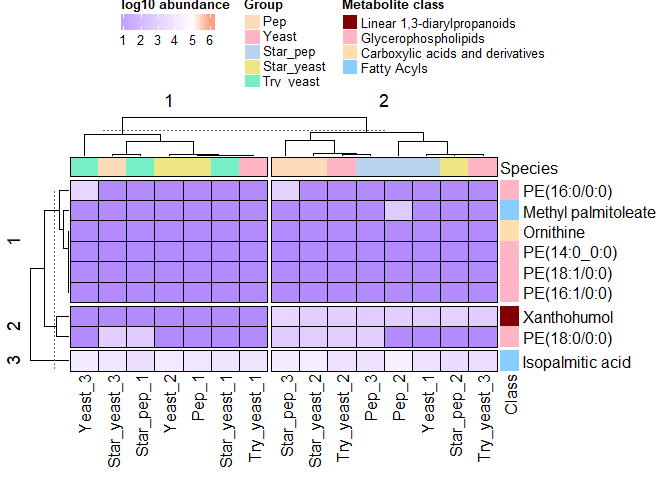

## Introduction

The present document aims to record the procedure given for the
statistical analysis of secondary metabolites present in the different
conditions of *bioles*. For each step a brief explanation, the code and
graphics obtained are included.

The workflow used is taken from the paper [“notame”: Workflow for
Non-Targeted LC–MS Metabolic
Profiling](https://doi.org/10.3390/metabo10040135). Which offers a wide
variety of functions to perform metabolomic profile analysis.

## Before to start

The “notame” package accepts as input a feature table that can be
obtained through software such as MZMine, MSDial, among others. In this
case, the table was obtained with the help of MZmine. The (\*.txt) file
was slightly modified to obtain the feature table.

Modifications made to the raw (\*.txt) file can be summarized in adding
and renaming columns. The added columns “Column” and “Ion Mode” allow to
analyze samples with different types of columns and with different
ionization modes respectively. Also, the cells corresponding to mass and
retention time must be renamed so that the package can detect and
process it.

## Notame workflow

As a first step for the analysis, all the necessary libraries were
installed and loaded in Rstudio.

``` r
# if (!requireNamespace("devtools", quietly = TRUE)) {
# install.packages("devtools")

devtools::install_github("antonvsdata/notame")
library(notame)
library(Biobase)
library(BiocGenerics)
library(futile.logger)
library(ggplot2)
library(magrittr)
library(foreach)
library(iterators)
library(parallel)
library(doParallel)
# if (!require("BiocManager", quietly = TRUE))
 #  install.packages("BiocManager")
# BiocManager::install("pcaMethods")
library(pcaMethods)
library(patchwork)
library(cowplot)
library(Rtsne)
library(ggdendro)
library(dplyr)
library(readxl)
library(ggsci)
# install.packages("igraph")
```

Then, a log system was added to have a record of each process executed.

``` r
init_log(log_file = "Results/Results_NEG_H2O.txt")
```

    ## INFO [2025-04-13 04:36:21] Starting logging

Next, the MZmine suitable feature list was imported.

``` r
data_neg <- read_from_excel(file = "Data/NEG_H2O.xlsx", sheet = 1, 
                        corner_row = 6, corner_column = "F", 
                        split_by = c("Column", "Ion Mode"))
```

Once the data is read, the next step was to create a MetaboSet in order
to obtain a specific R object.

``` r
modes_neg <- construct_metabosets(exprs = data_neg$exprs, 
                              pheno_data = data_neg$pheno_data, 
                              feature_data = data_neg$feature_data,
                              group_col = "Group")
```

We can visualize the raw data in order to inspect the processing
routines.

``` r
mode_neg <- modes_neg$RP_NEG
Prueba_mode_neg <- modes_neg$RP_NEG
NEG_raw_sambx <- plot_sample_boxplots(Prueba_mode_neg, order_by = "Group", fill_by = "Group")
NEG_raw_pca <- plot_pca(Prueba_mode_neg,
                        color = "Culture_media")
NEG_raw_pca + NEG_raw_sambx
```



## Preprocessing

The first step of the preprocessing is to change the features with value
equal to 0 to NA.

``` r
mode_neg <- mark_nas(mode_neg, value = 0)
```

Then, features with low detection rate are first flagged and then will
be removed. The notame package employs two criteria to select this
features. First, is the feature presence in a percentage of QC
injections, and then the feature presence in a percentage within a
sample group or class.

``` r
mode_neg <- flag_detection(mode_neg, qc_limit = 0.70, group_limit = 0.75)
```

With these values, features which that were not detected in the 70% of
the QC injections and 75% of sample groups will be discarded.

The next step for preprocessing correspond to drift correction. The
drift correction can be applied by smoothed cubic spline regression.

``` r
corrected_neg <- correct_drift(mode_neg)
corrected_neg <- flag_quality(corrected_neg, condition = "RSD_r < 0.27 & D_ratio_r < 0.56")
```

Then we can visualize the data after drift correction.

``` r
EI_corr_sambx_neg <- plot_sample_boxplots(corrected_neg, order_by = "Group", fill_by = "Group")
EI_corr_pca_neg <- plot_pca(corrected_neg, center = T)
EI_corr_pca_neg + EI_corr_sambx_neg
```



``` r
# Tercer método de corrección del efecto batch
 #Instalación del paquete RUVSeq
#if (!require("BiocManager", quietly = TRUE))
    #install.packages("BiocManager")
#BiocManager::install("RUVSeq")

#library(RUVSeq)

#Corrección del efecto batch mediante método RUVSeq (Removal of Unwanted variation)
#replicates <- list(which(corrected$QC == "QC"))
#batch_corrected <- ruvs_qc(corrected[["exprs"]], batch = "Batch")
#corrected_batch <- normalize_batches(corrected, batch = "Batch", group = "QC", ref_label = "QC")
```

The next step is feature clustering. This step helps us reduce the
number of features of the same molecule that were split due to
ionization behavior (In-source fragmentation for example).

``` r
clustered_neg <- cluster_features(corrected_neg,
                              rt_window = 1/60,
                              all_features = FALSE,
                              corr_thresh = 0.90,
                              d_thresh = 0.85
                              #plotting = TRUE,
                              #prefix = paste0(ppath, "Cluster/LCMS/LCMS_Cluster")
                              )
```

    ## INFO [2025-04-13 04:37:39] Identified m/z column mass and retention time column RT
    ## INFO [2025-04-13 04:37:39] 
    ## Starting feature clustering at 2025-04-13 04:37:39.916269
    ## INFO [2025-04-13 04:37:39] Finding connections between features in RP_NEG
    ## [1] 100
    ## [1] 200
    ## [1] 300
    ## [1] 400
    ## [1] 500
    ## [1] 600
    ## [1] 700
    ## [1] 800
    ## [1] 900
    ## [1] 1000
    ## [1] 1100
    ## [1] 1200
    ## [1] 1300
    ## INFO [2025-04-13 04:39:36] Found 10245 connections in RP_NEG
    ## INFO [2025-04-13 04:39:36] Found 10245 connections
    ## 66 components found
    ## 
    ## 53 components found
    ## 
    ## 30 components found
    ## 
    ## 15 components found
    ## 
    ## 13 components found
    ## 
    ## 11 components found
    ## 
    ## 6 components found
    ## 
    ## 10 components found
    ## 
    ## 9 components found
    ## 
    ## 11 components found
    ## 
    ## 9 components found
    ## 
    ## 10 components found
    ## 
    ## 14 components found
    ## 
    ## 13 components found
    ## 
    ## 21 components found
    ## 
    ## 23 components found
    ## 
    ## 9 components found
    ## 
    ## 1 components found
    ## 
    ## INFO [2025-04-13 04:39:47] Found 183 clusters of 2 or more features, clustering finished at 2025-04-13 04:39:47.032009

``` r
compressed_neg <- compress_clusters(clustered_neg)
```

    ## INFO [2025-04-13 04:39:47] Clusters compressed, left with 875 features

We can inspect data after clustering algorithm.

``` r
# PCA
compr_pca_neg <- plot_pca(compressed_neg,
                        center = TRUE,
                        shape = "Group",
                        color = "Group") 

compr_pca_neg
```



The next step imputes the data.

``` r
# To clean data
set.seed(35)
imputed_neg <- impute_rf(compressed_neg)
```

    ## INFO [2025-04-13 04:39:47] 
    ## Starting random forest imputation at 2025-04-13 04:39:47.821778
    ## INFO [2025-04-13 04:40:07] Out-of-bag error in random forest imputation: 0.303
    ## INFO [2025-04-13 04:40:07] Random forest imputation finished at 2025-04-13 04:40:07.647236

We can inspect PCA plot after imputation.

``` r
# Boxplot
imp_bp_neg <- plot_sample_boxplots(imputed_neg,
                               order_by = "Group",
                               fill_by = "Group")
# PCA
imp_pca_neg <- plot_pca(imputed_neg,
                    center = TRUE,
                    shape = "Group",
                    color = "Group")
# Plot
imp_pca_neg + imp_bp_neg
```



# Second PCA and loading plot

Droping flagged features

``` r
# Extract clean data
no_flag_neg <- drop_flagged(imputed_neg)
# Extracting feature height table
peak_height_neg <- exprs(no_flag_neg)
# Extracting samples information
pheno_data_neg <- no_flag_neg@phenoData@data
# Extracting feature information
feat_data_neg <- no_flag_neg@featureData@data
```

Preparing data and transposing feature table.

``` r
# Transposing feature height table
transp_table_neg  <- t(peak_height_neg)

# Changing NA to 0 
transp_table_neg[is.na(transp_table_neg)]=0

# Centering and Scaling features
neg_pca <- prcomp(transp_table_neg, center = TRUE, scale. = TRUE)
```

Plotting PCA results.

``` r
# PCA scores
scores_neg <- neg_pca$x %>%                  # Get PC coordinates
  data.frame %>%                         # Convert to data frames
  mutate(Sample_ID = rownames(.)) %>%    # Create a new column with the sample names
  left_join(pheno_data_neg)                 # Adding metadata
# PCA plot
ggplot(scores_neg,
       aes(PC1, PC2, shape = Group, color = Group)) +
  geom_point(size = 3) +
  guides(x=guide_axis(title = "PC1 (25.7 %)"),
         y=guide_axis(title = "PC2 (19.6 %)")) +
  theme_classic()
```



``` r
# Save plot
ggsave('Plots/PCA_NEG_H2O.pdf', width = 5, height = 4, device='pdf', dpi="print")
```

Plotting loading results.

``` r
loadings_neg <- neg_pca$rotation %>%    # Extract loadings
  data.frame(Cluster_ID = rownames(.))  # New column with feat name

# Exporting notame output to find and filter identified metabolites
write_to_excel(clustered_neg, "Results/Firts_features_name_NEG_H2O.xlsx")
```

Creating an artificial table with Feature name and Compound column.

``` r
# Load a metabolite name table
metab_name_neg <- readxl::read_excel("Data/NEG_H2O.xlsx", 2)
# Creating a new small table of the annotated compounds
neg_compouds <- left_join(metab_name_neg, loadings_neg)
```

``` r
ggplot(loadings_neg, aes(PC1, PC2)) +
  geom_point(alpha = 0.2) +
  theme_classic() +  # Aplicar tema base primero
  ggrepel::geom_label_repel(data = neg_compouds,
                            aes(label = Metabolite_name),
                            box.padding = 0.4,
                            label.padding = 0.1,
                            label.r = 0.1,
                            max.overlaps = 50,
                            # Cambiado 'cex' por 'size' y ajustado el valor
                            # Prueba con valores como 4, 5, 6, etc. hasta obtener el tamaño deseado
                            size = 5.23) +
  guides(x=guide_axis(title = "PC1 (25.7 %)"),
         y=guide_axis(title = "PC2 (19.6 %)")) +
  ggsci::scale_color_aaas() +
  # Añadir la capa theme() para modificar el tamaño de los títulos de los ejes
  theme(
    axis.title.x = element_text(size = 16), # Ajusta este valor (ej: 14, 16, 18)
    axis.title.y = element_text(size = 16)  # Ajusta este valor (ej: 14, 16, 18)
    # Opcionalmente, puedes ajustar también el tamaño del texto de las marcas de los ejes:
    # axis.text.x = element_text(size = 12),
    # axis.text.y = element_text(size = 12)
  ) + 
  scale_x_continuous(limits = c(-0.05, 0.07)) + # Reemplaza con tus valores deseados para X
  scale_y_continuous(limits = c(-0.07, 0.07))   # Reemplaza con tus valores deseados para Y
```

    ## Warning: Removed 42 rows containing missing values or values outside the scale range
    ## (`geom_point()`).

    ## Warning: Removed 9 rows containing missing values or values outside the scale range
    ## (`geom_label_repel()`).



``` r
#Save plot
ggsave('Plots/LOADING_NEG_H2O.pdf', width = 10, height = 8, device='pdf', dpi="print")
```

    ## Warning: Removed 42 rows containing missing values or values outside the scale range
    ## (`geom_point()`).
    ## Removed 9 rows containing missing values or values outside the scale range
    ## (`geom_label_repel()`).

# Heat map plot

ComplexHeatmap package and dependency installation.

``` r
# ComplexHeatmap package installation
# if (!requireNamespace("BiocManager", quietly=TRUE))
 # install.packages("BiocManager")
# BiocManager::install("ComplexHeatmap")
library(ComplexHeatmap)

# ColorRamp2 package installation
# if (!requireNamespace("devtools", quietly = TRUE)) 
  # install.packages("devtools")

# devtools::install_github("jokergoo/colorRamp2")
library(colorRamp2)

# Cowplot package installation
# install.packages("cowplot")
library(cowplot)
```

Extracting and loaded of identified metabolites abundance.

``` r
#"notame" output to find and filter height of identified metabolites
write_to_excel(no_flag_neg, "Results/parametaboanalyst_NEG_H2O.xlsx")
```

    ## INFO [2025-04-13 04:40:15] Moved Datafile column to last to get meaningful column names for abundances

``` r
# Metabolite name table
metab_name_hm <- readxl::read_excel("Results/IDLOADING_NEG_H2O.xlsx", 2)

hm_scl <- metab_name_hm[, 5:19] %>% as.matrix %>% log10()
rownames(hm_scl) <- metab_name_hm$Metabolite_name

# Metabolite classification
metab_class <- metab_name_hm %>% select(Class = Class, Metabolite = Metabolite_name)

# Metabolite class to HeatMap anotation
met_class_annotation <-  metab_class %>% select(Class) %>% 
  as.matrix()
rownames(met_class_annotation) <- metab_class$Metabolite

# Top information
top_info <- data.frame(Species = c( rep("Pep"),
                                    rep("Yeast"),
                                    rep("Star_pep"),
                                    rep("Star_yeast"),
                                    rep("Try_yeast"),
                                    rep("Pep"),
                                    rep("Yeast"),
                                    rep("Star_pep"),
                                    rep("Star_yeast"),
                                    rep("Try_yeast"),
                                    rep("Pep"),
                                    rep("Yeast"),
                                    rep("Star_pep"),
                                    rep("Star_yeast"),
                                    rep("Try_yeast"))) 

rownames(top_info) <- paste(top_info$Species, rep(c(1, 2, 3, 4, 5, 6, 7, 8, 9, 10, 11, 12, 13, 14, 15)))
top_info <- as.matrix(top_info)
```

Scaling, row and top heatmap anotation.

``` r
set.seed(2024)
# Metabolite class color
cols_metclass <- c("Linear 1,3-diarylpropanoids" = "#800000FF",
                   "Glycerophospholipids" = "#FFB5C5",
                   "Carboxylic acids and derivatives" = "#FFDEAD", 
                   "Fatty Acyls" = "#87CEFF")
                   
# Add row anotation to HeatMap
hm_row_ann <- rowAnnotation(Metabolite = met_class_annotation,
                            col = list(Metabolite = cols_metclass),
                            show_annotation_name = T,
                            show_legend= F)

cols_species <- c("Pep" = "#FFDAB9",
                 "Yeast" = "#FFB5C5",
                 "Star_pep" = "#B9D3EE",
                 "Star_yeast" = "#EEE685",
                 "Try_yeast" = "#76EEC6",
                 "Pep" = "#FFDAB9",
                 "Yeast" = "#FFB5C5",
                 "Star_pep" = "#B9D3EE",
                 "Star_yeast" = "#EEE685",
                 "Try_yeast" = "#76EEC6",
                 "Pep" = "#FFDAB9",
                 "Yeast" = "#FFB5C5",
                 "Star_pep" = "#B9D3EE",
                 "Star_yeast" = "#EEE685",
                 "Try_yeast" = "#76EEC6")


# Add top anotation to HeatMap

top_info_ann <- HeatmapAnnotation(Species = top_info,
                                  col = list(Species = cols_species),
                                  show_annotation_name = T,
                                  show_legend = F, 
                                  border = TRUE)
# Color scale

mycol <- colorRamp2(c(-5, 5, 7),
                    c("blue", "white", "red"))

# Heatmap matrix plotting

hm_plot <- Heatmap(hm_scl,
        col = mycol,
        border_gp = grid::gpar(col = "black", lty = 0.05),
        rect_gp = grid::gpar(col = "black", lwd = 0.75),
        clustering_distance_columns = "euclidean",
        clustering_method_columns = "complete",
        top_annotation = top_info_ann,
        right_annotation = hm_row_ann,
        show_heatmap_legend = F,
        row_km = 3, column_km = 2)
hm_plot
```



``` r
ggsave('Plots/heatmap_NEG_QC.png', width = 5, height = 4, device='png', dpi="print")
```

Adding legends to heatmap.

``` r
# Color scale legend
lgd1 <- Legend(col_fun = mycol,
               title = "log10 abundance",
               at = seq(6),
               direction = "horizontal" )
# Group legend
lgd2 <- Legend(labels = gt_render(c("Pep",
                                    "Yeast",
                                    "Star_pep",
                                    "Star_yeast",
                                    "Try_yeast")),
              legend_gp = gpar(fill = cols_species),
              title = 'Group', ncol = 1,
              direction = "horizontal" )
              
# Metabolite class Legend
lgd3 <- Legend(labels = c(unique(metab_class$Class)) ,
               legend_gp = gpar(fill = cols_metclass), 
               title = 'Metabolite class', ncol = 1,
               direction = "horizontal" )
```

ComplexHeatmap plot

``` r
set.seed(1540)
# Converting to ggplot
gg_heatmap <- grid.grabExpr(draw(hm_plot))
gg_heatmap <- ggpubr::as_ggplot(gg_heatmap)

# Legends
all_legends <- packLegend(lgd1, lgd2, lgd3, direction = "horizontal")
gg_legend <- grid.grabExpr(draw(all_legends))
gg_legend_fn <- ggpubr::as_ggplot(gg_legend)

# Heatmap plot
negqc_hm <- plot_grid(gg_legend_fn,
          gg_heatmap, ncol = 1,
          rel_heights = c(0.195, 0.88))
negqc_hm
```



``` r
# Save heatmap plot
ggsave(filename = "Plots/Firts_H2O_NEG_Heatmap.pdf", plot = negqc_hm,
      width = 8, height = 5, units = "in", dpi = 600, scale = 2)
```

Finish a record.

``` r
finish_log()
```

    ## INFO [2025-04-13 04:40:24] Finished analysis. Sun Apr 13 04:40:24 2025
    ## Session info:
    ## 
    ## INFO [2025-04-13 04:40:24] R version 4.4.2 (2024-10-31 ucrt)
    ## INFO [2025-04-13 04:40:24] Platform: x86_64-w64-mingw32/x64
    ## INFO [2025-04-13 04:40:24] Running under: Windows 11 x64 (build 26100)
    ## INFO [2025-04-13 04:40:24] 
    ## INFO [2025-04-13 04:40:24] Matrix products: default
    ## INFO [2025-04-13 04:40:24] 
    ## INFO [2025-04-13 04:40:24] 
    ## INFO [2025-04-13 04:40:24] locale:
    ## INFO [2025-04-13 04:40:24] [1] LC_COLLATE=Spanish_Ecuador.utf8  LC_CTYPE=Spanish_Ecuador.utf8   
    ## INFO [2025-04-13 04:40:24] [3] LC_MONETARY=Spanish_Ecuador.utf8 LC_NUMERIC=C                    
    ## INFO [2025-04-13 04:40:24] [5] LC_TIME=Spanish_Ecuador.utf8    
    ## INFO [2025-04-13 04:40:24] 
    ## INFO [2025-04-13 04:40:24] time zone: America/Guayaquil
    ## INFO [2025-04-13 04:40:24] tzcode source: internal
    ## INFO [2025-04-13 04:40:24] 
    ## INFO [2025-04-13 04:40:24] attached base packages:
    ## INFO [2025-04-13 04:40:24] [1] grid      parallel  stats     graphics  grDevices utils     datasets 
    ## INFO [2025-04-13 04:40:24] [8] methods   base     
    ## INFO [2025-04-13 04:40:24] 
    ## INFO [2025-04-13 04:40:24] other attached packages:
    ## INFO [2025-04-13 04:40:24]  [1] colorRamp2_0.1.0      ComplexHeatmap_2.22.0 ggsci_3.2.0          
    ## INFO [2025-04-13 04:40:24]  [4] readxl_1.4.5          dplyr_1.1.4           ggdendro_0.2.0       
    ## INFO [2025-04-13 04:40:24]  [7] Rtsne_0.17            cowplot_1.1.3         patchwork_1.3.0      
    ## INFO [2025-04-13 04:40:24] [10] pcaMethods_1.98.0     doParallel_1.0.17     iterators_1.0.14     
    ## INFO [2025-04-13 04:40:24] [13] foreach_1.5.2         notame_0.3.2          magrittr_2.0.3       
    ## INFO [2025-04-13 04:40:24] [16] ggplot2_3.5.1         futile.logger_1.4.3   Biobase_2.66.0       
    ## INFO [2025-04-13 04:40:24] [19] BiocGenerics_0.52.0  
    ## INFO [2025-04-13 04:40:24] 
    ## INFO [2025-04-13 04:40:24] loaded via a namespace (and not attached):
    ## INFO [2025-04-13 04:40:24]   [1] RColorBrewer_1.1-3   rstudioapi_0.17.1    shape_1.4.6.1       
    ## INFO [2025-04-13 04:40:24]   [4] magick_2.8.5         farver_2.1.2         rmarkdown_2.29      
    ## INFO [2025-04-13 04:40:24]   [7] GlobalOptions_0.1.2  fs_1.6.5             ragg_1.3.3          
    ## INFO [2025-04-13 04:40:24]  [10] vctrs_0.6.5          memoise_2.0.1        askpass_1.2.1       
    ## INFO [2025-04-13 04:40:24]  [13] rstatix_0.7.2        htmltools_0.5.8.1    usethis_3.1.0       
    ## INFO [2025-04-13 04:40:24]  [16] itertools_0.1-3      missForest_1.5       lambda.r_1.2.4      
    ## INFO [2025-04-13 04:40:24]  [19] curl_6.2.1           broom_1.0.7          cellranger_1.1.0    
    ## INFO [2025-04-13 04:40:24]  [22] Formula_1.2-5        htmlwidgets_1.6.4    futile.options_1.0.1
    ## INFO [2025-04-13 04:40:24]  [25] cachem_1.1.0         commonmark_1.9.2     igraph_2.1.4        
    ## INFO [2025-04-13 04:40:24]  [28] mime_0.12            lifecycle_1.0.4      pkgconfig_2.0.3     
    ## INFO [2025-04-13 04:40:24]  [31] R6_2.6.1             fastmap_1.2.0        shiny_1.10.0        
    ## INFO [2025-04-13 04:40:24]  [34] clue_0.3-66          digest_0.6.37        colorspace_2.1-1    
    ## INFO [2025-04-13 04:40:24]  [37] S4Vectors_0.44.0     pkgload_1.4.0        textshaping_1.0.0   
    ## INFO [2025-04-13 04:40:24]  [40] ggpubr_0.6.0         labeling_0.4.3       randomForest_4.7-1.2
    ## INFO [2025-04-13 04:40:24]  [43] abind_1.4-8          compiler_4.4.2       rngtools_1.5.2      
    ## INFO [2025-04-13 04:40:24]  [46] remotes_2.5.0        withr_3.0.2          backports_1.5.0     
    ## INFO [2025-04-13 04:40:24]  [49] carData_3.0-5        pkgbuild_1.4.6       ggsignif_0.6.4      
    ## INFO [2025-04-13 04:40:24]  [52] MASS_7.3-65          openssl_2.3.2        sessioninfo_1.2.3   
    ## INFO [2025-04-13 04:40:24]  [55] rjson_0.2.23         tools_4.4.2          zip_2.3.2           
    ## INFO [2025-04-13 04:40:24]  [58] httpuv_1.6.15        glue_1.8.0           promises_1.3.2      
    ## INFO [2025-04-13 04:40:24]  [61] gridtext_0.1.5       cluster_2.1.8        generics_0.1.3      
    ## INFO [2025-04-13 04:40:24]  [64] gtable_0.3.6         tidyr_1.3.1          car_3.1-3           
    ## INFO [2025-04-13 04:40:24]  [67] xml2_1.3.7           ggrepel_0.9.6        pillar_1.10.1       
    ## INFO [2025-04-13 04:40:24]  [70] markdown_1.13        stringr_1.5.1        later_1.4.1         
    ## INFO [2025-04-13 04:40:24]  [73] circlize_0.4.16      tidyselect_1.2.1     miniUI_0.1.1.1      
    ## INFO [2025-04-13 04:40:24]  [76] knitr_1.49           IRanges_2.40.1       stats4_4.4.2        
    ## INFO [2025-04-13 04:40:24]  [79] xfun_0.51            devtools_2.4.5       credentials_2.0.2   
    ## INFO [2025-04-13 04:40:24]  [82] matrixStats_1.5.0    stringi_1.8.4        yaml_2.3.10         
    ## INFO [2025-04-13 04:40:24]  [85] evaluate_1.0.3       codetools_0.2-20     tibble_3.2.1        
    ## INFO [2025-04-13 04:40:24]  [88] cli_3.6.4            xtable_1.8-4         systemfonts_1.2.1   
    ## INFO [2025-04-13 04:40:24]  [91] munsell_0.5.1        Rcpp_1.0.14          gert_2.1.4          
    ## INFO [2025-04-13 04:40:24]  [94] png_0.1-8            ellipsis_0.3.2       doRNG_1.8.6.1       
    ## INFO [2025-04-13 04:40:24]  [97] profvis_0.4.0        urlchecker_1.0.1     viridisLite_0.4.2   
    ## INFO [2025-04-13 04:40:24] [100] scales_1.3.0         openxlsx_4.2.8       purrr_1.0.4         
    ## INFO [2025-04-13 04:40:24] [103] crayon_1.5.3         GetoptLong_1.0.5     rlang_1.1.5         
    ## INFO [2025-04-13 04:40:24] [106] formatR_1.14

``` r
#Finish a record.
```
